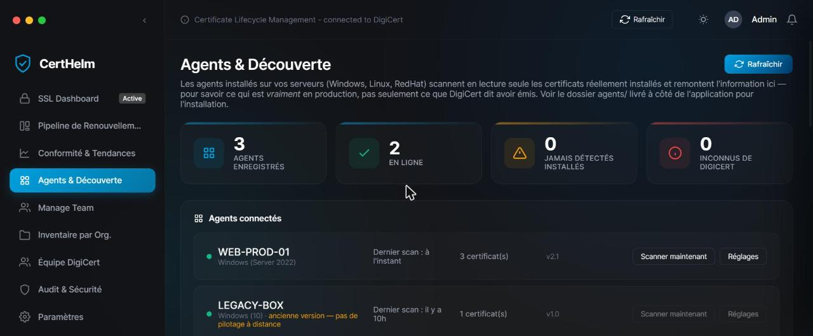
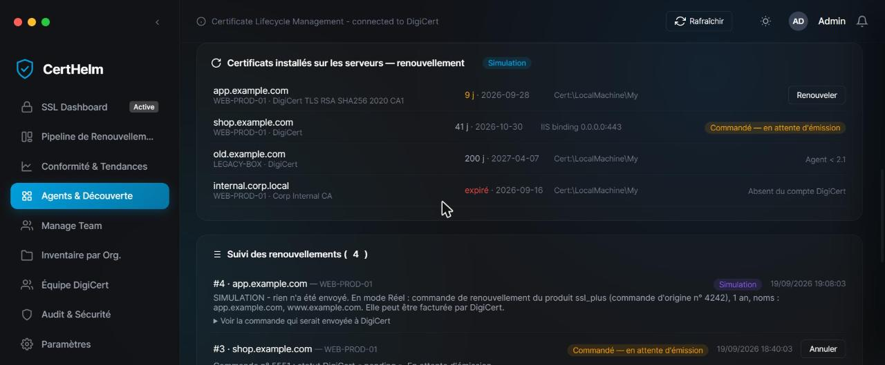

# CertHelm

**Gestion du cycle de vie des certificats pour les organisations qui exploitent leurs certificats TLS via DigiCert CertCentral**

[English version](README.md) | [Guide pas à pas Windows](docs/guide-windows.fr.md) | [Architecture](docs/architecture.md) | [Modèle de sécurité](docs/security.md)

> **Projet indépendant.** CertHelm n'est ni affilié à DigiCert, Inc., ni approuvé ou parrainé par cette société.
> « DigiCert » est une marque de son propriétaire, citée uniquement pour indiquer la compatibilité avec l'API DigiCert CertCentral.

---

## Synthèse

Les organisations qui exploitent des certificats TLS à grande échelle sont exposées à trois risques récurrents : des interruptions de
service dues à des certificats expirés, des certificats émis mais jamais déployés, et des certificats en production
qu'aucun processus central ne connaît. La console de l'autorité de certification indique ce qui a été *émis* ; elle n'indique pas ce qui est *installé*.

CertHelm comble cet écart. La solution consolide l'inventaire détenu dans DigiCert CertCentral, vérifie par des agents légers ce qui est
réellement déployé sur chaque serveur et, sous contrôles explicites, automatise le renouvellement et l'installation des certificats.

| Résultat attendu | Moyen de mise en œuvre |
|---|---|
| **Visibilité** | Un tableau de bord unique : commandes, horizons d'expiration, statut de validation, historique des renouvellements. |
| **Assurance** | Rapprochement continu entre les certificats émis par l'autorité et ceux installés sur les serveurs. |
| **Automatisation maîtrisée** | Renouvellement et installation avec mode simulation, consentement par serveur, commande atomique et retour arrière automatique. |

**Statut : bêta.** La supervision, la découverte et le pilotage à distance sont couverts par des tests automatisés. La chaîne de renouvellement
automatisé n'a été vérifiée que contre une autorité simulée ; voir [Maturité du projet](#maturité-du-projet) avant tout usage en production.

## Problématique

| Risque | Cause habituelle | Réponse de CertHelm |
|---|---|---|
| Interruption de service liée à un certificat expiré | Renouvellements suivis manuellement ou par rappels de calendrier | Supervision des expirations, alertes, pipeline de renouvellement |
| Certificat renouvelé mais jamais déployé | Absence de retour d'information entre l'autorité et les serveurs | Les agents remontent les certificats installés ; rapprochement émis / installé |
| Certificats inconnus en production | Certificats obtenus hors du processus central | Détection des certificats absents du compte de l'autorité |
| Renouvellement lent et sujet aux erreurs | Clé, CSR, commande et installation réparties entre équipes | Parcours guidé et chaîne automatisée optionnelle |
| Automatisation sur-privilégiée | Scripts à droits étendus, sans modèle de consentement | Liste blanche de commandes, adhésion par serveur, simulation par défaut |

## Périmètre fonctionnel

| Domaine | Contenu |
|---|---|
| **Supervision et alertes** | Inventaire des commandes avec compte à rebours, filtres et export CSV ; notifications bureau ; alertes SMTP optionnelles ; messages préparés pour approbateurs, responsables DNS et installateurs. |
| **Workflow de renouvellement** | Tableau par étapes (approbation, validation DNS, commande, installation, vérification) avec relances et historique. |
| **Conformité et tendances** | Statistiques de durée de validité ; historique des renouvellements construit automatiquement. |
| **Découverte et rapprochement** | Agents Windows et Linux ; identification des certificats émis mais non déployés, et déployés mais inconnus de l'autorité. |
| **Opérations à distance** | Scan à la demande, fréquence et activation par agent, via un canal où seul l'agent initie la connexion. |
| **Renouvellement automatisé** | Clé et CSR générés sur le serveur, commande auprès de l'autorité, vérification du certificat émis, installation par l'agent (magasin Windows et bindings IIS ; fichiers PEM et rechargement du service sous Linux). Désactivé sauf activation explicite. |
| **Gouvernance** | Affectations par domaine, journal d'audit, notes et listes de contrôle. |

## Vues du produit

| Agents et découverte | Suivi des renouvellements (mode simulation) |
|---|---|
|  |  |

*Captures réalisées avec des données fictives.*

## Cadre de maîtrise des risques

| Objectif de contrôle | Dispositif en place |
|---|---|
| **Confidentialité des clés privées** | Les clés sont générées sur le serveur cible et ne sont jamais transmises ; seule la demande de signature circule. |
| **Intégrité des certificats déployés** | Le contrôleur vérifie le certificat émis (clé, domaine, validité) ; l'agent vérifie à nouveau avant tout remplacement. |
| **Maîtrise des dépenses et des actions non voulues** | Simulation par défaut ; confirmation explicite par renouvellement ; verrou atomique d'une commande unique ; résultats ambigus gelés pour revue humaine. |
| **Moindre privilège et périmètre d'impact limité** | Adhésion par serveur ; listes blanches de commandes des deux côtés ; le contrôleur n'envoie jamais de chemin ni de ligne de commande. |
| **Capacité de reprise** | Linux : sauvegardes horodatées, test de configuration, restauration automatique. Windows : bindings restaurés en cas d'échec, ancien certificat conservé. |
| **Gestion des secrets** | Clé API, mot de passe SMTP et jeton d'agent dans le coffre d'identifiants du système ; aucun secret dans le dépôt. |
| **Exposition réseau** | Connexions initiées par l'agent uniquement. Risque résiduel : canal en HTTP avec jeton partagé (voir [docs/security.md](docs/security.md)). |

## Démarche d'adoption

| Phase | Objectif | Activation |
|---|---|---|
| **1. Observer** | Vue consolidée de l'inventaire et du risque d'expiration | Connecter la clé API CertCentral |
| **2. Rapprocher** | Comparer certificats émis et installés | Déployer les agents en scan en lecture seule |
| **3. Piloter** | Administrer les agents de façon centralisée | Agents en fonctionnement continu ; scan et réglages à distance |
| **4. Automatiser** | Renouveler et installer sous contrôle | Simulation, puis environnement de démonstration DigiCert sur un serveur non critique, puis production |

## Démarrage

Prérequis : Windows 10 ou 11, Python 3.10 à 3.12, une clé API CertCentral.

```powershell
git clone https://github.com/abdouhanafi/certhelm.git
cd certhelm
python -m venv .venv
.venv\Scripts\activate
pip install -r requirements.txt

cd certhelm      # l'application résout ui/, config.json et workflow.db depuis le dossier courant
python main.py
```

1. **Paramètres, Connexion DigiCert** : saisir la clé API CertCentral (conservée dans le Gestionnaire d'identification Windows, jamais dans un fichier).
2. Le tableau de bord se renseigne à partir du compte.
3. Facultatif : déployer des agents ([docs/agents.md](docs/agents.md), en anglais).

Le guide détaillé, avec pare-feu, installation des agents et dépannage, est disponible dans [docs/guide-windows.fr.md](docs/guide-windows.fr.md).

## Maturité du projet

| Composant | Statut | Base |
|---|---|---|
| Inventaire, supervision, alertes | Testé | Tests automatisés |
| Agents de découverte (Windows, Linux) | Testé | Tests automatisés ; logique Linux exécutée avec un vrai `openssl` en dossiers temporaires |
| Scan et réglages à distance | Testé | Tests de bout en bout, y compris l'agent compilé |
| Machine à états du renouvellement et garde-fous | Testé contre une autorité simulée | Plus de 60 contrôles : concurrence, cas d'échec, retour arrière |
| Appels DigiCert (commande, statut, téléchargement) | **Non validé en réel** | Conformes à la documentation publique ; exécutés contre un faux serveur local uniquement |
| `certreq` et bindings IIS sous Windows | **Non validé sur machines réelles** | Commandes simulées dans les tests |
| Rechargement du serveur web sous Linux | **Non validé sur machines réelles** | Faux service dans les tests |

Parcours de validation recommandé avant production : simulation, puis mode Réel sur l'environnement de démonstration DigiCert
(`https://demo.digicert.com/services/v2`) avec un serveur non critique, journal de l'agent supervisé.

## Structure, qualité, compilation

Voir le [README en anglais](README.md) (sections *Repository structure*, *Quality assurance*, *Building executables*).

## Gouvernance

| Sujet | Référence |
|---|---|
| Règles de contribution | [CONTRIBUTING.md](CONTRIBUTING.md) |
| Signalement de vulnérabilités | [SECURITY.md](SECURITY.md) |
| Modèle de sécurité | [docs/security.md](docs/security.md) |
| Licence | [MIT](LICENSE) |
