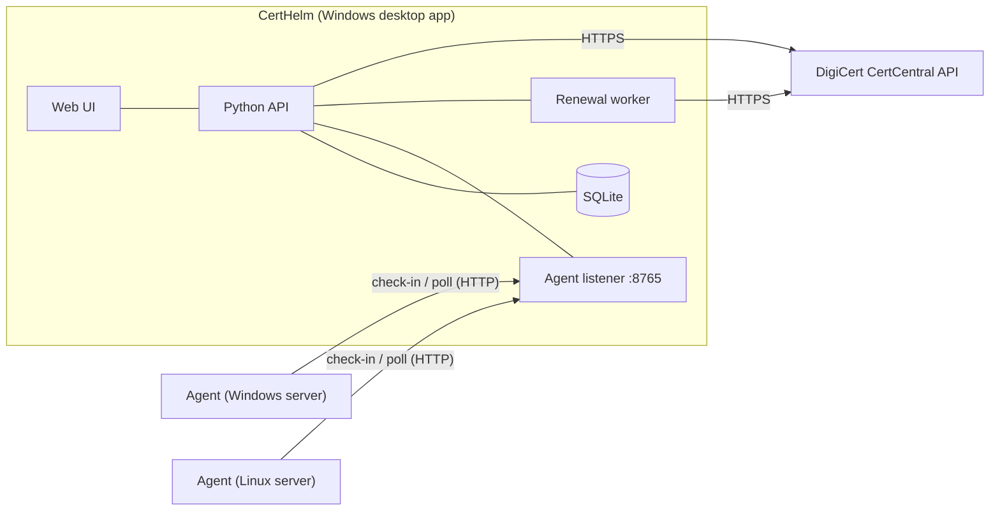

# CertHelm

**Certificate Lifecycle Management (CLM) for DigiCert CertCentral.**
See every certificate you own, find out what is *really* deployed on your servers, and renew and install certificates safely — from one desktop app.

> 🇫🇷 Version française : [README.fr.md](README.fr.md) · 📘 Guide pas à pas Windows (FR, prérequis, commandes, agents) : [docs/guide-windows.fr.md](docs/guide-windows.fr.md)

> **Independent project.** CertHelm is not affiliated with, endorsed by, or sponsored by DigiCert, Inc.
> "DigiCert" is a trademark of its owner and is used here only to describe compatibility with the DigiCert CertCentral API.

**Status: beta.** The discovery, monitoring and agent features are exercised by automated tests. The automatic-renewal
pipeline has only been run against a fake DigiCert server — see [Project status](#project-status) before using it for real.

---

## Features

| Area | What you get |
|---|---|
| **Dashboard** | All DigiCert orders in one place: expiry countdown, status, product, organization, filters, CSV export. |
| **Renewal pipeline** | A board that tracks each certificate through approval → DNS validation → order → install → verify, with reminders. |
| **Compliance & trends** | Validity-period statistics and an automatically built renewal history. |
| **Alerts** | Desktop notifications and optional SMTP e-mail alerts before expiry; ready-to-send e-mail drafts for approvers, DNS owners and installers. |
| **Inventory & audit** | Domains and organizations with validation status, DigiCert users, audit log. |
| **Agents & discovery** | Lightweight agents (Windows / Linux) report the certificates *actually installed* on each server. CertHelm flags certificates DigiCert issued but that were never deployed, and certificates found in production that DigiCert does not know about. |
| **Remote control** | "Scan now", scan frequency and enable/disable per agent — over a pull-only channel (see [Security](docs/security.md)). |
| **Automatic renewal** | One-click renewal: the agent creates the key and CSR **on the server**, CertHelm orders the renewal, checks the issued certificate, and the agent installs it (Windows store + IIS bindings, or PEM files + service reload on Linux) with rollback on failure. Off by default, with a no-side-effects **Simulation** mode. |

| Agents & discovery | Renewal (Simulation mode) |
|---|---|
|  |  |

*Screenshots use sample data.*

## How it works



Agents **never accept incoming connections**: they call the controller (CertHelm) periodically. Commands reach an agent only
as the answer to one of its own polls, and only from a short fixed allow-list. Details: [docs/architecture.md](docs/architecture.md).

## Quick start

> A detailed French walkthrough (prerequisites, every command, firewall, agents, troubleshooting) is in [docs/guide-windows.fr.md](docs/guide-windows.fr.md).

Requirements: Windows 10/11 (the desktop app uses WebView2 and the Windows Credential Manager), Python 3.10+.

```powershell
git clone <your-repository-url> certhelm
cd certhelm
python -m venv .venv
.venv\Scripts\activate
pip install -r requirements.txt

cd certhelm          # the app looks for ui/, config.json and workflow.db relative to the working directory
python main.py
```

1. Open **Paramètres → Connexion DigiCert** and paste a CertCentral API key.
   The key is stored in the Windows Credential Manager — never in a file.
2. The dashboard fills with your orders.
3. Optional: deploy agents — see [docs/agents.md](docs/agents.md).

Runtime files (`config.json`, `workflow.db`) are created in the working directory and are git-ignored.

> The interface text is currently mostly French. Translations and an i18n layer are welcome contributions.

## Agents

The agent is a **single Python file** with no third-party dependency (`agent/certhelm_agent.py`), also built as a Windows
executable with a graphical installer.

* Windows: run `CertHelmAgent_Setup.exe`, paste the controller URL and token, pick a run mode.
* Linux / RedHat: run the script under systemd (`--daemon`).

Full guide, configuration keys and troubleshooting: **[docs/agents.md](docs/agents.md)**.

## Automatic renewal

Set in **Paramètres → Renouvellement automatique**:

| Mode | Effect |
|---|---|
| **Disabled** | No renewal possible. |
| **Simulation** *(default)* | Builds and shows the order that *would* be placed. Sends nothing, contacts no agent. |
| **Live** | Runs the full chain. **Places a real DigiCert order, which may be billed.** |

Each server must additionally opt in with `"allow_cert_management": true` in its own `agent_config.json`.
Design, state machine and safety guarantees: **[docs/renewal.md](docs/renewal.md)**.

## Security in one minute

* Private keys are generated on the server and **never leave it**; only the CSR travels.
* The controller never sends a file path or a command line to an agent; the agent finds the target certificate itself.
* An agent only installs a certificate that matches the key it generated for that exact job.
* A renewal can never place two orders (atomic claim); ambiguous outcomes are frozen for a human to check.
* The agent/controller channel is **plain HTTP with a shared token** — keep it on a trusted network or behind a TLS proxy.

Read [docs/security.md](docs/security.md) before deploying beyond a test environment.

## Building executables

```powershell
pip install -r packaging/requirements-build.txt
powershell -File packaging/build_windows.ps1
```

Produces `dist/CertHelm/CertHelm.exe` (desktop app) and `dist/agent/CertHelmAgent.exe` + `CertHelmAgent_Setup.exe`.
The installer requests administrator rights (it creates a SYSTEM scheduled task).

## Tests

```bash
pip install cryptography
python tests/run_all.py
```

The tests use a fake DigiCert server, temporary folders and stubbed system commands. They never contact DigiCert, never
touch a real certificate store, and replace the credential store with an in-memory fake.

## Project layout

```
certhelm/        desktop app: main.py (API + agent listener), database.py, renewal.py, digicert_api.py, ui/
agent/           certhelm_agent.py (Windows + Linux), installer_windows.py, config example
packaging/       PyInstaller spec and Windows build script
docs/            architecture, agents, renewal, security
tests/           automated tests (run_all.py)
```

## Project status

* Discovery, remote scan/settings and the renewal state machine are covered by automated tests (150+ checks).
* **Not validated against the live DigiCert service:** request/response formats of the order, status and download calls follow
  the public API documentation but have only run against a local fake. Try Live mode first on DigiCert's demo environment
  (`https://demo.digicert.com/services/v2`, configurable in Settings) with a non-critical server.
* **Not exercised on real machines:** `certreq` and IIS binding updates, reloading a real nginx/httpd.
* Windows-only desktop app; the agent runs on Windows and Linux.

## Contributing

See [CONTRIBUTING.md](CONTRIBUTING.md). Security issues: [SECURITY.md](SECURITY.md).

## License

[MIT](LICENSE)
