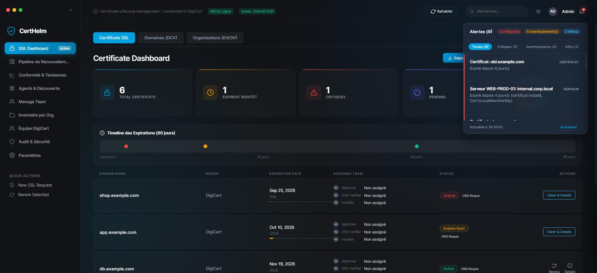
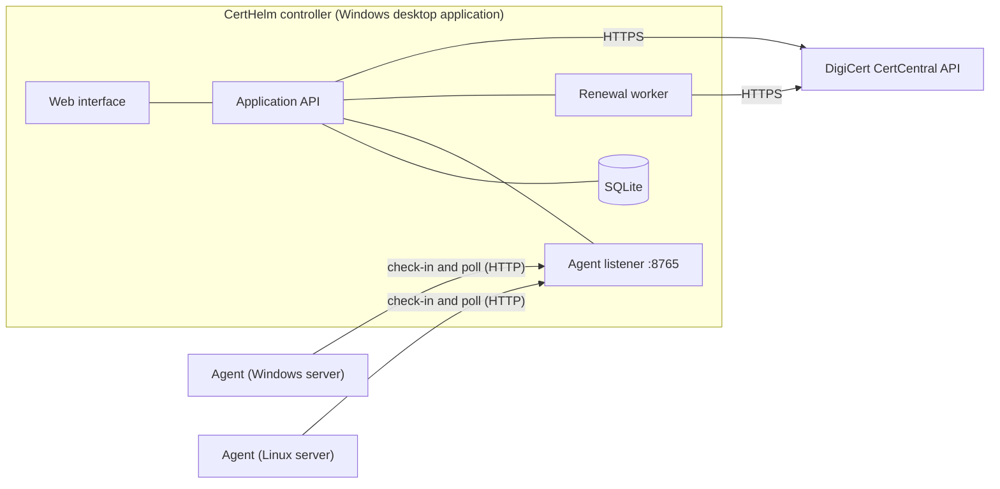

# CertHelm

**Certificate lifecycle management for organisations that operate TLS certificates through DigiCert CertCentral**

[Version française](README.fr.md) | [Windows step-by-step guide (French)](docs/guide-windows.fr.md) | [Architecture](docs/architecture.md) | [Security model](docs/security.md)

> **Independent project.** CertHelm is not affiliated with, endorsed by, or sponsored by DigiCert, Inc.
> "DigiCert" is a trademark of its owner and is used solely to describe compatibility with the DigiCert CertCentral API.

---

## Executive summary

Organisations that run TLS certificates at scale carry three recurring exposures: service outages caused by expired certificates,
certificates that are issued but never deployed, and certificates in production that no central process knows about.
The certificate authority's console shows what was *issued*; it does not show what is *installed*.

CertHelm closes that gap. It consolidates the certificate inventory held in DigiCert CertCentral, verifies through lightweight
agents what is actually deployed on each server, and, under explicit controls, automates the renewal and installation of
certificates.

| Outcome | How it is delivered |
|---|---|
| **Visibility** | A single dashboard of all orders, expiry horizons, validation status and renewal history. |
| **Assurance** | Continuous reconciliation between certificates issued by the CA and certificates installed on servers. |
| **Controlled automation** | Renewal and installation with per-server consent, a confirmation that spells out the exact order, atomic ordering and automatic rollback. |

**Status: beta.** Monitoring, discovery and remote operations are covered by automated tests. The automated-renewal chain has been
verified against a simulated CA only; see [Project maturity](#project-maturity) before any production use.

## Problem statement

| Exposure | Typical root cause | CertHelm response |
|---|---|---|
| Outage caused by an expired certificate | Renewals tracked manually or by calendar reminders | Expiry monitoring, desktop and e-mail alerts, renewal pipeline |
| Certificate renewed but never deployed | No feedback loop between the CA and the servers | Agents report installed certificates; issued-versus-installed reconciliation |
| Unknown certificates in production | Certificates obtained outside the central process | Detection of certificates absent from the CA account |
| Slow, error-prone renewal | Key generation, CSR, order and installation split across teams | Guided workflow and an optional automated chain |
| Over-privileged automation | Scripts running with broad rights and no consent model | Command allow-list, per-server opt-in, explicit confirmation of every order |

## Capabilities

| Domain | Scope |
|---|---|
| **Monitoring and alerting** | Order inventory with expiry countdown, filters and CSV export; an alert centre (bell) covering DigiCert expiries, certificates just expired, certificates found expiring on servers, agents gone offline, failed renewals and broken connections, refreshed every minute; desktop notifications; optional SMTP alerts; drafted communications for approvers, DNS owners and installers. |
| **Renewal workflow** | Stage-based board (approval, DNS validation, order, installation, verification) with reminders and history. |
| **Compliance and trends** | Validity-period statistics; renewal history built automatically from observed changes. |
| **Discovery and reconciliation** | Windows and Linux agents report installed certificates; the platform flags certificates issued but not deployed, and certificates deployed but unknown to the CA. |
| **Agent deployment** | One self-contained installer, `CertHelmAgent_Setup.exe`, to hand to a server's administrator: it checks the address and token, installs the agent into an administrator-only folder, registers it to start with Windows, and waits until the server shows up in the console. Silent mode for scripted deployments. |
| **Remote operations** | Per agent: status, address, version, certificates reported, on-demand scan, scan frequency, enable or disable, removal from the console, all over a pull-only channel. |
| **Automated renewal** | Key and CSR generated on the server, order placed with the CA, issued certificate verified, then installed by the agent (Windows certificate store and IIS bindings; PEM files and service reload on Linux). Disabled unless explicitly enabled. |
| **Governance** | Team assignments per domain, audit log, per-domain notes and checklists. |

## Product views

| Alert centre | Agents and discovery | Renewal tracking |
|---|---|---|
|  |  |  |

*Screenshots use sample data.*

## Solution architecture



Agents never accept inbound connections. They call the controller periodically; commands reach an agent only as the reply to one of
its own polls and only from a short, fixed allow-list. Details: [docs/architecture.md](docs/architecture.md).

## Risk and control framework

| Control objective | Control implemented |
|---|---|
| **Confidentiality of private keys** | Keys are generated on the target server and are never transmitted; only the certificate signing request travels. |
| **Integrity of deployed certificates** | The controller verifies the issued certificate against the request key, the domain and the validity period; the agent verifies again before replacing anything. |
| **Protection against duplicate or unintended spend** | Explicit confirmation per renewal showing the exact DigiCert order (product, names, original order); a global on/off switch; atomic single-order claim; ambiguous outcomes are frozen for human review. |
| **Least privilege and limited blast radius** | Per-server opt-in; command allow-list on both sides; the controller never supplies a file path or a command line. |
| **Recoverability** | Linux: timestamped backups, configuration test, automatic restoration. Windows: bindings restored on failure, previous certificate retained. |
| **Secret management** | API key, SMTP password and agent token held in the operating-system credential store; no secret in the repository. |
| **Network exposure** | Agent-initiated connections only. Residual risk: the agent channel is plain HTTP with a shared token (see [docs/security.md](docs/security.md)). |

## Adoption approach

The platform is designed to be adopted in stages, each of which delivers value without requiring the next.

| Phase | Objective | Activation |
|---|---|---|
| **1. Observe** | Consolidated view of CA inventory and expiry risk | Connect the CertCentral API key |
| **2. Reconcile** | Compare issued and installed certificates | Deploy agents in read-only scan mode |
| **3. Operate** | Manage agents centrally | Run agents continuously; use remote scan and settings |
| **4. Automate** | Renew and install with controls | Allow renewal on one non-critical server when installing its agent; first run against the DigiCert demonstration environment, then production |

## Getting started

Prerequisites: Windows 10 or 11, Python 3.10 to 3.12, a CertCentral API key. The desktop application relies on WebView2 and the
Windows Credential Manager.

```powershell
git clone https://github.com/abdouhanafi/certhelm.git
cd certhelm
python -m venv .venv
.venv\Scripts\activate
pip install -r requirements.txt

cd certhelm          # the application resolves ui/, config.json and workflow.db from the working directory
python main.py
```

1. Open **Paramètres, Connexion DigiCert** and enter the CertCentral API key. It is stored in the Windows Credential Manager, never in a file.
2. The dashboard populates from the CertCentral account.
3. Optional: deploy agents (see [docs/agents.md](docs/agents.md)).

Runtime files (`config.json`, `workflow.db`) are created in the working directory and are excluded from version control.
A detailed walkthrough in French, including firewall configuration and agent installation, is provided in
[docs/guide-windows.fr.md](docs/guide-windows.fr.md). The interface text is currently mostly in French.

## Project maturity

| Component | Status | Basis |
|---|---|---|
| Inventory, monitoring, alert centre | Tested | Automated tests, and exercised in a browser against a local fake DigiCert |
| Discovery agents (Windows, Linux) | Tested | Automated tests; Linux logic exercised with real `openssl` in temporary directories |
| Remote scan, agent settings, agent removal | Tested | End-to-end tests including the compiled agent; also driven manually against a real Windows 11 agent |
| Agent installer | Tested | Automated tests with Windows commands recorded, plus a manual install on Windows 11 (agent registered and controlled from the console) |
| Renewal state machine and safeguards | Tested against a simulated CA | 60+ automated checks: concurrency, failure modes, rollback |
| DigiCert order, status and download calls | **Not validated live** | Follows the public API documentation; exercised against a local fake only |
| Windows `certreq` and IIS binding updates | **Not validated on real hosts** | Commands are simulated in tests |
| Web-server reload on Linux | **Not validated on real hosts** | Fake service used in tests |

Recommended validation path before production: run a first renewal against the DigiCert demonstration environment
(`https://demo.digicert.com/services/v2`, set in Settings) on a non-critical server, with the agent log monitored.

Planned directions: per-agent credentials and TLS on the agent channel, a headless controller so that renewals progress without the
desktop application open, an internationalisation layer, and additional installation targets.

## Repository structure

```
certhelm/        Controller: main.py, alerts.py, database.py, renewal.py, digicert_api.py, ui/
agent/           certhelm_agent.py (Windows and Linux), installer_windows.py, configuration example
packaging/       PyInstaller specification and Windows build script
docs/            Architecture, agents, renewal, security, Windows guide
tests/           Automated tests (run_all.py)
```

## Quality assurance

```bash
pip install cryptography
python tests/run_all.py
```

The tests use a simulated DigiCert server, temporary directories and stubbed system commands. They never contact DigiCert, never
touch a real certificate store, and replace the credential store with an in-memory fake. They run on every push through GitHub Actions.

## Building executables

```powershell
pip install -r packaging/requirements-build.txt
powershell -File packaging/build_windows.ps1
```

Output: `dist/CertHelm/CertHelm.exe`, `dist/agent/CertHelmAgent.exe` and `dist/agent/CertHelmAgent_Setup.exe`.
`CertHelmAgent_Setup.exe` embeds the agent: it is the only file to give to a server's administrator. It requests administrator
rights because it installs into `C:\Program Files\CertHelmAgent` and registers a SYSTEM scheduled task.

## Governance

| Topic | Reference |
|---|---|
| Contribution rules | [CONTRIBUTING.md](CONTRIBUTING.md) |
| Vulnerability disclosure | [SECURITY.md](SECURITY.md) |
| Security model and hardening checklist | [docs/security.md](docs/security.md) |
| Automated renewal design and safeguards | [docs/renewal.md](docs/renewal.md) |
| License | [MIT](LICENSE) |
