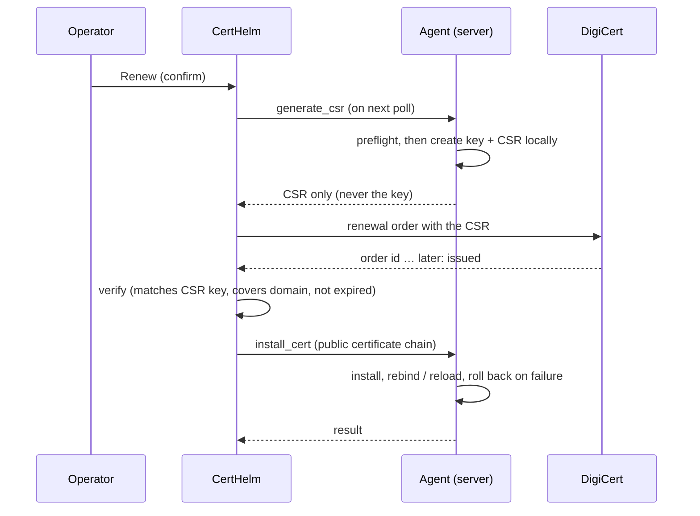

# Automatic renewal

> **Read this first.** In **Live** mode CertHelm places a real DigiCert order (possibly billed) and an agent replaces a
> certificate on a server. The DigiCert calls have not been validated against the live service — see
> [Trying it safely](#trying-it-safely).

## Modes

Set in **Paramètres → Renouvellement automatique** (stored in the database, so saving other settings never resets it).

| Mode | What "Renouveler" does |
|---|---|
| **Disabled** | Refuses. |
| **Simulation** *(default)* | Builds the exact order that would be sent and stores it for inspection. **No network call, no agent command.** |
| **Live** | Runs the whole chain below. A confirmation is asked when enabling Live, then again for every renewal. |

A certificate can be renewed only if its domain has an **issued order in your DigiCert account** (the renewal is linked to it and
reuses its product, organization and names) and the agent is v2.1+.

## The chain (Live)

### States

| Status | Meaning |
|---|---|
| `awaiting_csr` | Waiting for the agent to prepare the key and CSR (times out after 15 min, nothing ordered). |
| `csr_ready` | CSR received and validated; order about to be placed. |
| `ordering` | The order request is being sent. |
| `ordered` | DigiCert has the order; CertHelm polls its status (domain validation may be needed on DigiCert's side; gives up after 14 days). |
| `installing` | Issued certificate handed to the agent (times out after 30 min). |
| `installed` | Done. |
| `failed` | Ended with an error; the message says whether anything was ordered and what to do. |
| `cancelled` | Cancelled by the operator. A DigiCert order already placed is **not** cancelled — do it on the DigiCert portal. |
| `uncertain` | The order request had an ambiguous outcome (timeout, 5xx). It **blocks** any new renewal of that certificate until an operator checks the DigiCert portal and cancels the job. |
| `simulated` | Result of a Simulation. |

The worker that advances jobs runs inside the CertHelm app: **renewals only progress while CertHelm is open.**

## Safety guarantees

* **One order per renewal.** The `csr_ready → ordering` transition is an atomic compare-and-swap performed *before* the network
  call, so concurrent workers or ticks cannot both order. Ambiguous outcomes freeze in `uncertain` rather than retry.
* **Preflight before paying.** `generate_csr` checks that the server can actually install (certificate present, private key
  found, write access, web service detected, admin rights…). If not, the job fails before any order.
* **Key never leaves the server.** Windows: non-exportable machine key created by `certreq`. Linux: `openssl` key in a private
  folder next to the agent.
* **Key/certificate binding.** The issued certificate is verified against the CSR's public key by the controller, and again by
  the agent (Windows enforces it in `certreq -accept`) before anything is replaced.
* **No paths or commands from the controller.** The agent finds the certificate to replace from its own scan (by thumbprint),
  re-validates every name it receives, and takes test/reload commands only from its own `agent_config.json`.
* **Opt-in per server.** `"allow_cert_management": true` in the agent's own config. The controller cannot switch it on.
* **API key destination.** The DigiCert base URL can only be an `https://` address on `digicert.com`.
* **Rollback.** Linux: timestamped backups of the certificate and key, config test, reload; any failure restores the originals
  and deletes the backups. Windows: IIS bindings are switched back if a rebind fails; the old certificate is never deleted.

## What gets installed where

**Windows** — `certreq -new/-accept` (machine store, non-exportable key), intermediate certificates imported into the CA store,
HTTPS bindings that used the old certificate are moved to the new one through the IIS `WebAdministration` module. Without
IIS the certificate is installed in the store only. The agent must run as administrator/SYSTEM.

**Linux / RedHat** — the certificate file (leaf + intermediates) and the private-key file found next to the old certificate
are replaced atomically, then the service configuration is tested and the service reloaded (nginx, httpd, apache2 auto-detected
under systemd, or the `test_command` / `reload_command` you configure).

**Not supported** (the job fails explicitly instead of doing something risky): key and certificate in the same file, symbolic
links (e.g. Let's Encrypt `live/`), password-protected keys, certificates served on a port with no file, non-IIS HTTP.sys bindings.

## Trying it safely

1. Keep **Simulation** and click *Renouveler*: inspect the order that would be sent (expandable in *Suivi des renouvellements*).
2. Get an API key for DigiCert's **demo** environment, set the API URL to `https://demo.digicert.com/services/v2` in Settings
   and switch to **Live** — orders there are not billed.
3. Use a non-critical server with `allow_cert_management` enabled, and watch `agent.log`.
4. Only then consider production.

## Troubleshooting

| Message | Meaning / action |
|---|---|
| "n'a pas de commande émise dans votre compte DigiCert" | The domain has no issued order in this account (other CA or another account). |
| "Droits administrateur requis" | Run the agent as SYSTEM (background-task mode). |
| "Clé privée actuelle introuvable" | Linux: no key file next to the certificate matches it (or it is password-protected). |
| "Aucun service web actif détecté" | Set `reload_command` (and `test_command`) in `agent_config.json`. |
| "Statut incertain" | Check the DigiCert portal for an order; then cancel the job in CertHelm. |
| "Le certificat a été ÉMIS … installation échouée" | The order exists; install the certificate manually from DigiCert. The old one is still in place. |
